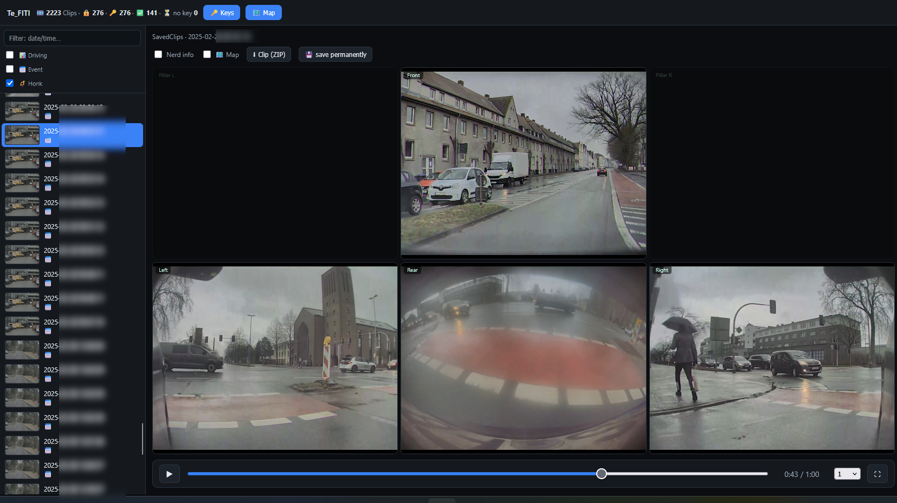

# Te_FITI – Tesla Fleet Integration, Telemetry & Infotainment

Home Assistant add-on repository.

**Te_FITI** is a multi-camera dashcam viewer that plays Tesla Dashcam and
Sentry clips from your NAS with a live telemetry HUD, GPS map and event
metadata. It can optionally decrypt encrypted clips (firmware 2026.20+) —
this requires a one-time login to your Tesla account to fetch the encryption
keys; after that, everything runs fully local and offline.

## Installation

1. **Settings → Add-ons → Add-on Store**
2. Top right **⋮ → Repositories**
3. Add this URL: `https://github.com/bernd780/Te_FITI`
4. Reload the store → install **Te_FITI**

See [tesla_dashcam_decryptor/README.md](tesla_dashcam_decryptor/README.md) for full documentation.
